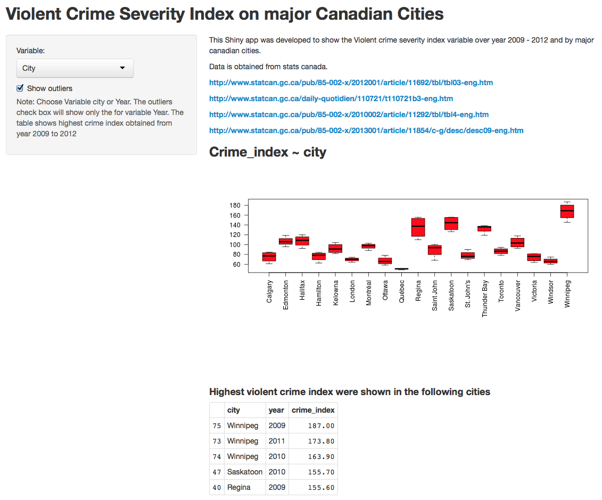

## Introduction

This application is developed for the sole purpose of Developing Data Products 
assignment. The app outputs a box plot of Crime index variable against year and city.
The data is obtained from statistic Canada websites. Ony major Canadian cities 
violent crime index from 2009 to 2012 is used.

Here are the links, if you are interested

http://www.statcan.gc.ca/pub/85-002-x/2012001/article/11692/tbl/tbl03-eng.htm
http://www.statcan.gc.ca/daily-quotidien/110721/t110721b3-eng.htm
http://www.statcan.gc.ca/pub/85-002-x/2010002/article/11292/tbl/tbl4-eng.htm
http://www.statcan.gc.ca/pub/85-002-x/2013001/article/11854/c-g/desc/desc09-eng.htm
                

--- .class #id 

## The App
### Server.R

I have used city and year as input variable and crime_index as a response variable. 

The following code shows the main syntax used in Server.R the making of the box plot
and the top 5 cities ranked based on high crime index variable. This link provides 
acomplete Server.R file from github repo.

https://github.com/Yohannesz/data_products/blob/master/server.R

        output$CrimePlot <- renderPlot({ 
        boxplot(as.formula(formulaText()), 
                data = IndexData, las=2, par(mar = c(14, 5, 4, 2)+ 0.1), col="red",
                        #horzontal=TRUE, varwidth=TRUE,
                        cex.lab=1.3, outline = input$outliers)
        })
        output$view <- renderTable({
                head(SortIndex, n = 5)

--- .class #id

## The App (conted.)
### Ui.R
In Ui.R, I have tried to construct 

1. Sidebar which ables us to select input variable,
2. MainPanel which produces the outputs that were constructed in server.R  
3. A check box for outliers

Here is a link for the github ripo to see the full file.

https://github.com/Yohannesz/data_products/blob/master/ui.R

--- .class #id

## App Style

    

--- 

